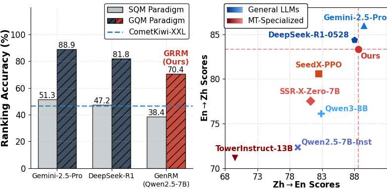
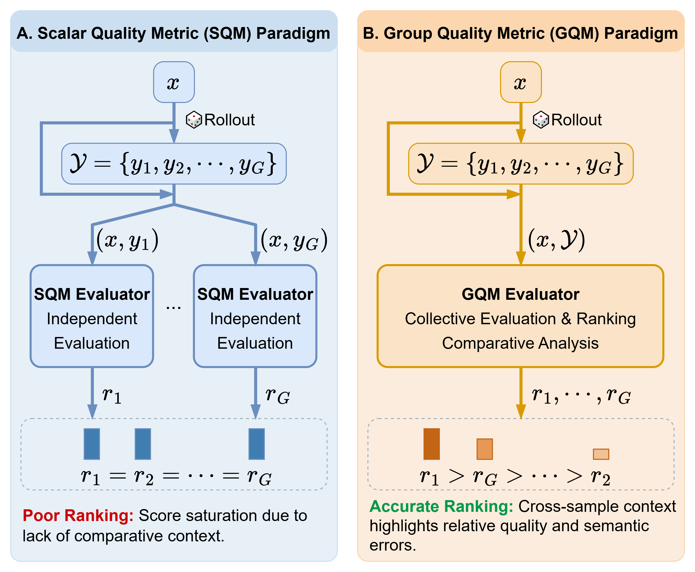
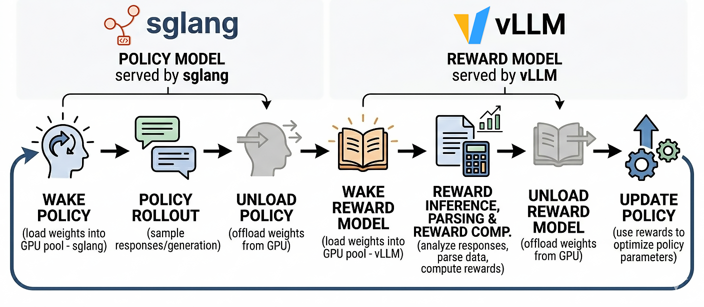

# GRRM: Group Relative Reward Modeling for Machine Translation

<a href="https://arxiv.org/abs/2602.14028">
  </a>
<a href="https://huggingface.co/collections/double7/grrm">
  </a>
<a href="https://huggingface.co/collections/double7/grrm">
  </a>
<a href="LICENSE">
  </a>

Official implementation of the paper: **GRRM: Group Relative Reward Modeling for Machine Translation**.

This repository contains the code for **GRRM (Group Relative Reward Model)**, a Generative Reward Model** instantiated under the proposed **Group Quality Metric (GQM) paradigm for **reinforcement learning-based machine translation (MT) optimization** with **GRPO**.

The RL training pipeline is powered by our **[verl with Generative Reward Models support](https://github.com/DoubleVII/verl/tree/gen_rm)** fork, designed to be generic and reusable for any GenRM-based RL training.

## Highlights

- **Improved reward accuracy:** large gains especially on challenging samples (idioms, slang, terminology) and restores reward variance needed by GRPO advantages. Also Robust to reward hacking.
- **GRRM**: efficient GQM-based reward model trained with SFT + RLVR.
- **Cross-lingual generalization**: GRRM trained on Zh–En can support multilingual MT optimization.
- **MT optimization**: GRPO training with GRRM yields strong improvements on WMT-style benchmarks and challenge sets.


Ranking accuracy performance and downstream translation performance on Seed-X-Challenge:
<p align="center">
  
</p>

## Method Overview


**Core idea:** Standard generative reward models often evaluate candidates independently (**Scalar Quality Metric, SQM**) and suffer from score saturation, which causes vanishing advantages in GRPO and stalls optimization.  
We propose **GQM**, which evaluates a *group* of candidates jointly to produce reliable fine-grained intra-group ranking, and implement it as **GRRM**, a high-throughput reward model with explicit comparative reasoning.

**GQM** evaluates the *entire group* together and outputs:
- comparative analysis
- predicted ranking
- scores consistent with that ranking

<p align="center">
  
</p>

## Performance Overview


---

## Getting Started

### Installation

```bash
git clone https://github.com/NJUNLP/GRRM.git
cd GRRM
pip install -e . --no-build-isolation
```

Extra dependencies available:
- `infer`: install vllm for inference.
- `eval`: sacrebleu and bleurt for translation evaluation.

For model training, additional dependencies are required. We use [Llama-Factory](https://github.com/hiyouga/LlamaFactory) for SFT training and [verl with Generative Reward Models support](https://github.com/DoubleVII/verl/tree/gen_rm) for reinforcement learning training.


### Quick Use

**1) Use GRRM to rank a group of translations (GQM inference)**

[This script](inference/run_rm_GQM.py) performs Group Quality Metric (GQM) inference using vLLM to evaluate and rank multiple translation candidates. It includes prompt templates, result parsing and return the scores and raw model outputs.

Example usage:
```python
import inference.run_rm_GQM as rm_GQM

output = rm_GQM.func_call(
    model_path="double7/GRRM-Qwen2.5-7B",
    src_list=["I have a frog in my throat."],
    mt_list=[["我嗓子有点哑。", "我嗓子眼里好像有只青蛙。"]],
    src_langs=["en"],
    trg_langs=["zh"],
    temperature=1.0,
    top_p=1.0,
    max_new_tokens=8192,
    retry=6,
    prompt_type="ranking_score",
)

# output["scores"] -> [[8, 3]]  # scores for each candidate
# output["responses"] -> ["...model response text..."]
```


> [!NOTE]  
> - Inference at low `temperature` may fail. Set `retry` to automatically retry with higher temperature.
> - For GRRM, set `prompt_type` to `ranking_score`.

**2) Use GRRM-Optimized MT model for translation inference**

[This script](inference/run_mt.py) performs machine translation inference using vLLM. It supports multiple prompt formats and answer extraction methods for different model types. It returns a dictionary with translation responses and raw model outputs.

Example usage:
```python
import inference.run_mt as mt

output = mt.func_call(
    model_path="double7/Qwen2.5-7B-MT-GRRM-Optimized",
    src_list=["The grass is always greener on the other side.", "INTJ总是装E"],
    src_langs=["en", "zh"],
    trg_langs=["zh", "en"],
    temperature=0.7,
    top_p=0.9,
    max_new_tokens=8192,
    retry=6,
    prompt_type="codeblock-think",
    use_chat_template=True,
)

# output["responses"] -> ["这山望着那山高。", "INTJs are always putting on an extroverted front."]
# output["raw_outputs"] -> ["...raw model output...", "...raw model output..."]
```

> [!NOTE]  
> - Inference at low `temperature` may fail. Set `retry` to automatically retry with higher temperature.
> - For GRRM-Optimized MT models, set `prompt_type` to `codeblock-think`.

## Training Pipeline

### Additional Codebase

Our reinforcement learning pipeline for GRRM is based on our fork: [verl with Generative Reward Models support](https://github.com/DoubleVII/verl/tree/gen_rm). It is developed as the training backend for GRRM, but the GenRM support is designed to be **generic and reusable**.



### Detailed Training Recipes

For GRRM training, please refer to [GRRM Training Pipeline](recipes/GRRM_training_pipeline.md).

For using GRRM for downstream machine translation GRPO training, please refer to [MT Training Pipeline](recipes/MT_training_pipeline.md).


## Evaluation

### Ranking Accuracy Evaluation

**Data Preparation:**

Run the following commands to download the held-out testset with Gemini-annotated rankings:

```bash
hf download double7/TowerBlocks-MT-Ranking --repo-type dataset --local-dir parquet_data/TowerBlocks-MT-Ranking
```

Run the following commands to download the human-derived testset for ranking accuracy evaluation, along with the Seed-X-Challenge binary ranking task data:
```bash
hf download double7/MT_Ranking_Metric_Test --repo-type dataset --local-dir parquet_data/MT_Ranking_Metric_Test
```

**Evaluation:**

Run evaluation for [Qwen2.5-7B-GRRM](https://huggingface.co/double7/Qwen2.5-7B-GRRM) on all datasets:
```bash
python eval/run_ranking_acc_eval.py \
    --data_id tower_zhen_ranking_testset,wmt_newstest2020_psqm,wmt_generalMT2022_enzh_mqm,wmt_generalMT2022_zhen_mqm,wmt_generalMT2022_ende_mqm,wmt_generalMT2022_enru_mqm,seedx_challenge_ranking \
    --model_path path/to/Qwen2.5-7B-GRRM \
    --model_name Qwen2.5-7B-GRRM \ # model name for logging
    --temperature 0 \
    --top_p 1.0 \
    --max_new_tokens 8192 \
    --prompt_type ranking_score \
    --model_type grrm \
    --runs 4
```

> [!NOTE]  
> - The mapping between data id and data path is defined in `RANKING_TEST_DATA_META_INFO` of [utils/config.py](utils/config.py).

### Machine Translation Evaluation

**Data Preparation:**

We use existing public datasets for evaluation. For WMT23 test, refer to [sacrebleu tool](https://github.com/mjpost/sacrebleu?tab=readme-ov-file#downloading-test-sets). For WMT24++, refer to [google/wmt24pp](https://huggingface.co/datasets/google/wmt24pp). For Seed-X-Challenge set, refer to [ByteDance-Seed/Seed-X-7B](https://github.com/ByteDance-Seed/Seed-X-7B/tree/main/challenge_set).


**Data Format**

Convert downloaded data to parquet format with the following required columns:

| Column Name | Description | Required |
|-------------|-------------|----------|
| `src_text` | Source text to translate | Yes |
| `trg_text` | Reference translation (ground truth) | Yes |
| `src_lang` | Source language code (e.g., "en", "zh", "de") | Yes |
| `trg_lang` | Target language code (e.g., "en", "zh", "de") | Yes |
| `comment` | Evaluation hints/translation focus points (optional) | No |

> [!NOTE]
> Seed-X-Challenge provides additional translation evaluation points. These should be stored in the `comment` column. When present, the comment will be concatenated with the reference translation and provided to LLM-based evaluation models (e.g., gpt-oss). BLEURT evaluation does not use these comments.

**Dataset Configuration**

Register your datasets in [utils/config.py](utils/config.py) by adding entries to `MT_TEST_DATA_META_INFO`:

**Evaluation:**

Run evaluation for [Qwen2.5-7B-MT-GRRM-Optimized](https://huggingface.co/double7/Qwen2.5-7B-MT-GRRM-Optimized) on Zh<->En data:

```bash
python eval/run_mt_eval.py \
    --data_id seedx_challenge_zhen,seedx_challenge_enzh,wmt24pp_en_zh,wmt23_zh_en \
    --model_path path/to/Qwen2.5-7B-MT-GRRM-Optimized \
    --model_name Qwen2.5-7B-MT-GRRM-Optimized \
    --temperature 0 \
    --top_p 1 \
    --max_new_tokens 8192 \
    --metrics '["bleurt","oss"]' \
    --prompt_type codeblock-think \
    --runs 4
```


## Citation

```bibtex
@article{yang2026grrmgrouprelativereward,
      title={GRRM: Group Relative Reward Modeling for Machine Translation}, 
      author={Sen Yang and Shanbo Cheng and Lu Xu and Jianbing Zhang and Shujian Huang},
      year={2026},
      eprint={2602.14028},
      archivePrefix={arXiv},
      primaryClass={cs.CL},
      url={https://arxiv.org/abs/2602.14028},
}
```